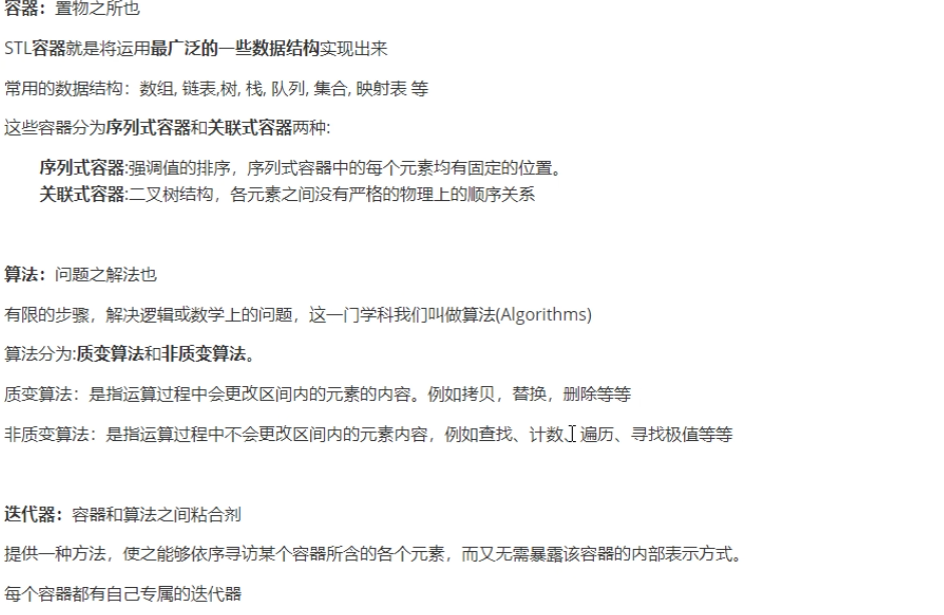
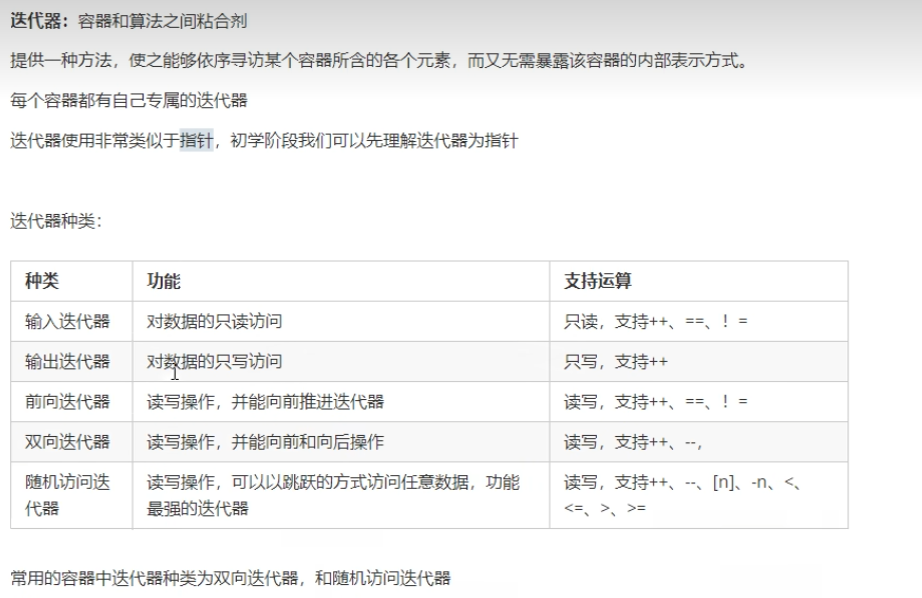

<!--
 * @Author: 15868707168@163.com 15868707168@163.com
 * @Date: 2023-03-29 14:52:33
 * @LastEditors: 15868707168@163.com 15868707168@163.com
 * @LastEditTime: 2023-03-31 11:28:40
 * @FilePath: \CPlusPlusLessons\STL\1.STL.MD
 * @Description: 这是默认设置,请设置`customMade`, 打开koroFileHeader查看配置 进行设置: https://github.com/OBKoro1/koro1FileHeader/wiki/%E9%85%8D%E7%BD%AE
-->

#### 1. 基本概念
+ STL(Standard Template Library,==标准模板库==)

+ STL从广义上分为：
    + **容器(container)**
    + **算法(algorithm)**
    + **迭代器(iterator)**

+ **容器**和**算法**之间通过**迭代器**进行无缝连接  

+ STL六大组件：
    + **容器：** 各种数据结构，如vector、list、deque、set、map等，用来存放数据
    + **算法：** 各种常用的算法，如sort、find、copy、for_each等
    + **迭代器：** 扮演了容器和算法之间的胶合剂
    + **仿函数：** 行为类似函数，可以作为算法的某种策略
    + **适配器（配接器）：** 一种用来修饰容器或者仿函数或迭代器接口的东西
    + **空间配置器：** 负责空间的配置和管理

+ 

+ 
