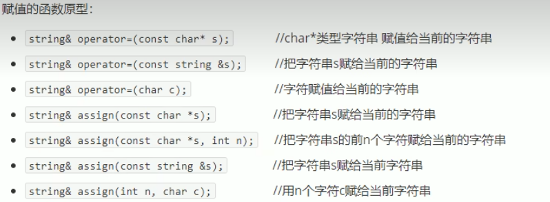
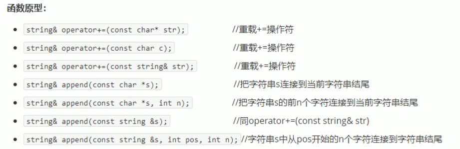
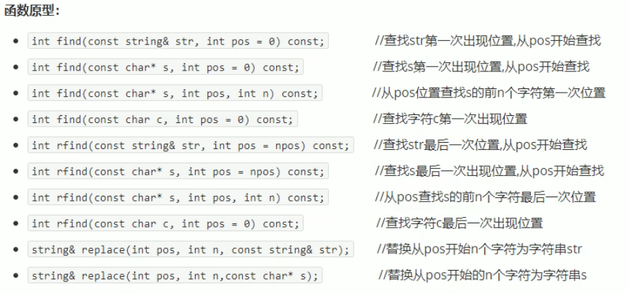
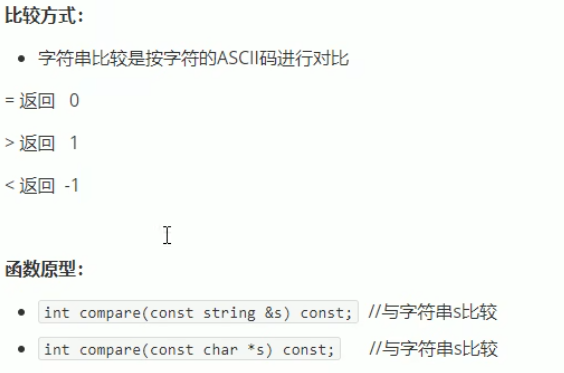
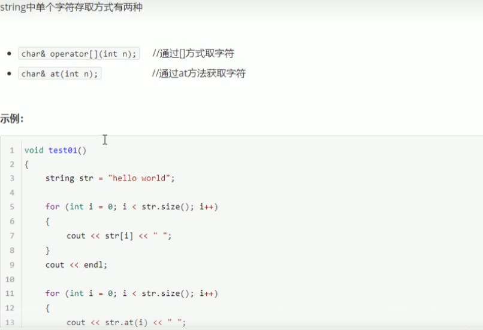
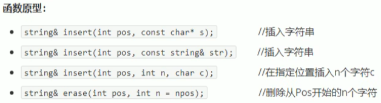
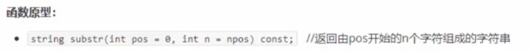

<!--
 * @Author: 15868707168@163.com 15868707168@163.com
 * @Date: 2023-03-29 15:12:11
 * @LastEditors: 15868707168@163.com 15868707168@163.com
 * @LastEditTime: 2023-03-29 17:14:29
 * @FilePath: \CPlusPlusLessons\STL\容器\2.string.md
 * @Description: 这是默认设置,请设置`customMade`, 打开koroFileHeader查看配置 进行设置: https://github.com/OBKoro1/koro1FileHeader/wiki/%E9%85%8D%E7%BD%AE
-->
#### 1. 基本概念
+ **本质：** string 是C++风格的字符串，而string本质是一个类
+ **string和char*区别：** 
  + char* 是一个指针
  + string 是一个类，类内部封装了char*，管理这个字符串，是一个char*型的容器
+ **特点：**
  + string 类内部封装了很多成员方法
  + eg: find、copy、delete、replace、insert
  + string 管理 char* 所分配的内存，不用担心复制越界和取值越界等，由类内部进行负责

#### 2. 构造函数
+ `string()`  //创建一个空的字符串 例如：string str
  `string(const char* s)` //使用字符串s初始化
+ `string(const string& str)` //使用一个string 对象初始化另一个对象
+ `string(int n,char c)` //使用n个字符c初始化

#### 2. 赋值操作
+ =
+ assign()

#### 3. 拼接操作

#### 4. 查找和替换操作

#### 5. 比较

#### 6. 存取

#### 7. 插入和删除

#### 8. 子串

