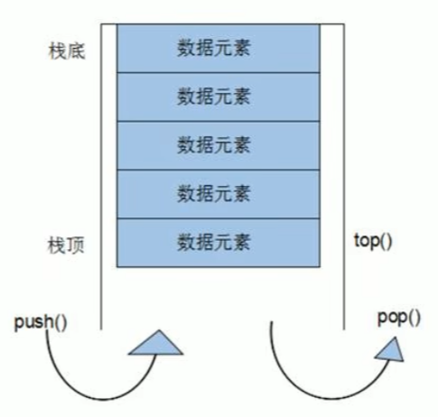

<!--
 * @Author: 15868707168@163.com 15868707168@163.com
 * @Date: 2023-03-30 14:08:49
 * @LastEditors: 15868707168@163.com 15868707168@163.com
 * @LastEditTime: 2023-03-30 14:30:27
 * @FilePath: \CPlusPlusLessons\STL\容器\4.stack.md
 * @Description: 这是默认设置,请设置`customMade`, 打开koroFileHeader查看配置 进行设置: https://github.com/OBKoro1/koro1FileHeader/wiki/%E9%85%8D%E7%BD%AE
-->
#### 1. 基本概念
+ stack 是一种**先进后出**(First In Last Out,FILO)的数据结构，只有一个出口

+ 

#### 2. 构造函数
+ `stack<T> stk`  //stack采用模板类实现，stack对象的默认构造形式
+ `stack(const stack& stk)`  //拷贝构造函数
  
#### 3. 赋值操作
+ `stack& operator=(const stack& stk)` //重载等号操作符

#### 4. 数据存取
+ `push(elem)` //向栈顶添加元素
+ `pop()`     //从栈顶移除第一个元素
+ `top`       //返回栈顶元素
 
#### 5. 大小操作
+ `empty()` //判断栈是否为空 
+ `size()` //返回栈的大小


```C++
	stack<int> stk;

	stk.push(19);
	stk.push(23);
	stk.push(232);

	while (!stk.empty())
	{
		cout << stk.top() << endl;
		stk.pop();
	}

	cout << stk.size() << endl;
```