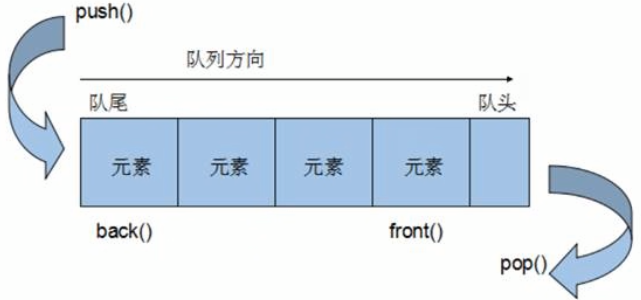

<!--
 * @Author: 15868707168@163.com 15868707168@163.com
 * @Date: 2023-03-30 14:29:59
 * @LastEditors: 15868707168@163.com 15868707168@163.com
 * @LastEditTime: 2023-03-30 14:37:37
 * @FilePath: \CPlusPlusLessons\STL\容器\5.queue.md
 * @Description: 这是默认设置,请设置`customMade`, 打开koroFileHeader查看配置 进行设置: https://github.com/OBKoro1/koro1FileHeader/wiki/%E9%85%8D%E7%BD%AE
-->
#### 1. 基本概念
+ queue 是一种**先进先出**(First In First Out,FIFO)的数据结构，它有两个出口

+ 

#### 2. 构造函数
+ `queue<T> que`  //queue采用模板类实现，queue对象的默认构造形式
+ `queue(const queue& que)`  //拷贝构造函数
  
#### 3. 赋值操作
+ `queue& operator=(const queue& stk)` //重载等号操作符

#### 4. 数据存取
+ `push(elem)`    //向栈顶添加元素
+ `pop()`         //从栈顶移除第一个元素
+ `back()`        //返回最后一个元素
+ `front()`       //返回第一个元素

#### 5. 大小操作
+ `empty()` //判断队列是否为空 
+ `size()` //返回队列的大小
